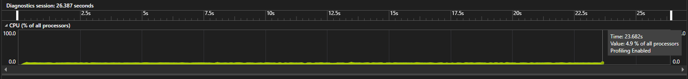
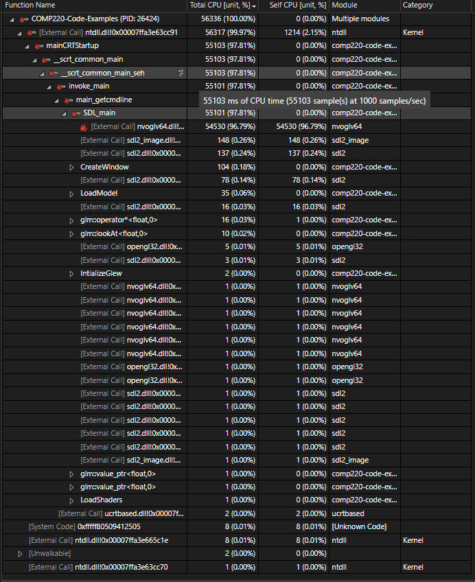

Screenshot taken after running the prototype using the instrumentation tool. There was a peak of 6.7 percent CPU usage with a average of around 5 percent throughout the run time.

Screenshot of CPU usage hot path, the hot path reveals that 96.79 percent of the usage the protoype generates is associated with nvoglv64.dll, after some reasearch it seems this is a link library used by nvidia graphics drivers. More specifically it handles OpenGL functionality for nvidia GPUs.

nvoglv64.dll details source: Pilici, S. (2023) Nvoglv64.dll: What it is & how to fix errors, MalwareTips Blog. Available at: https://malwaretips.com/blogs/nvoglv64-dll-what-it-is-how-to-fix-errors/ (Accessed: 28 November 2024). 