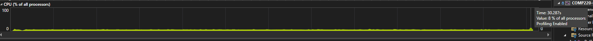
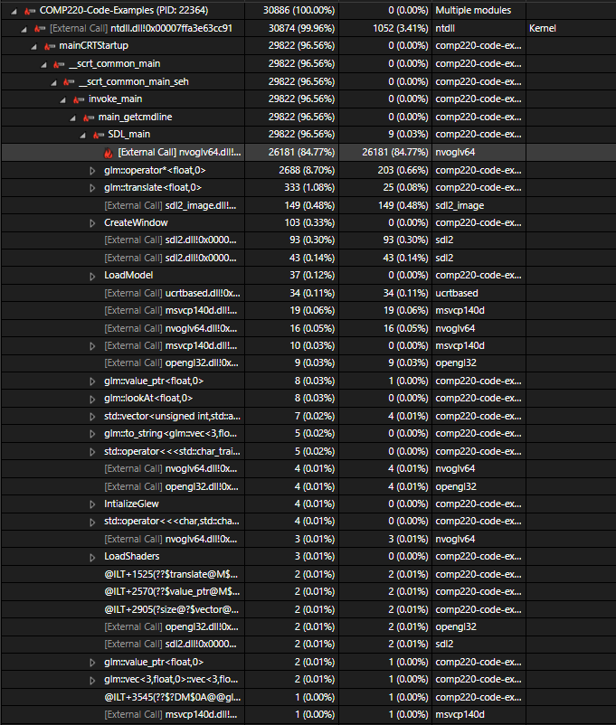
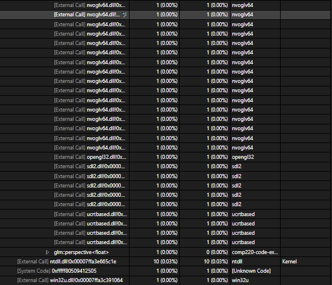

After adding the feature of multiple model loading to the artefact I then proceeded to stress test it by loading and testing different numbers of models.

### 1 model loaded:

Average cpu usage of 5 percent with a peak of 6 percent through a 30 second run time.

Just like before I added the multiple model loading the hot path points to nvoglv64.dll using the majority of resources required by the artefact. This is the a link library responsible for linking openGL with nvidia GPUs. There is not much room for optimization here as this is necessary to make openGL work on nvidia GPUs.

### 10 modles loaded:

Again average cpu use of 5 percent however with a peak of 7 percent instead of 6 seconds through a 30 second run time.

Hot path does not show any substantial change, however the link library used around an extra 0.2 percent of usage, will contiune and see if this keeps increasing with amount of models.

### 100 modles loaded:

Average usage is still 5 percent however the peak has increased again to 8 percent over the 30 second run time.

As expected the link library is still using the most of the resources, however it's usage has gone down instead of increasing which I was not expecting, this is likely due to the "glm::operator* <float,0>" operation which has over taken the sld2_image call for the second most resource heavy operation. Increasing from 0.12 to 0.92 when going from 10 to 100 models. I would expect this value to keep increasing as I keep adding models.

### 1000 models loaded:

Average use is still 5 percent and the peak has not increased by 8 percent when I was expecting it to when increasing the amount of models again.

When increasing to loading 1000 models the "glm::operator* <float,0>" usage has multiplied by almost 10. I expect it to continue to increase as more models are added.
