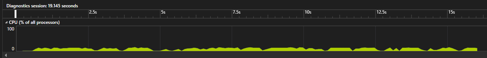
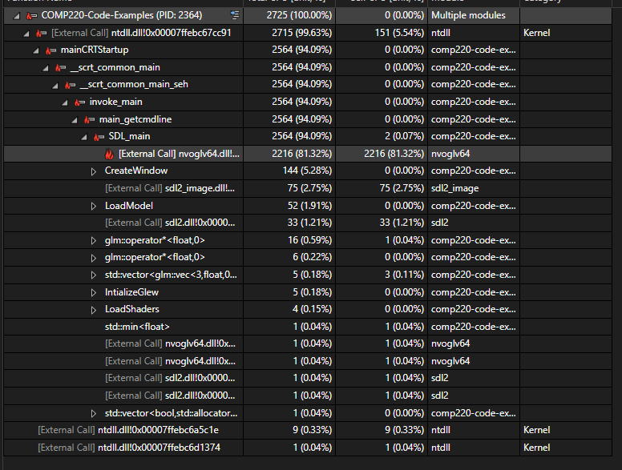
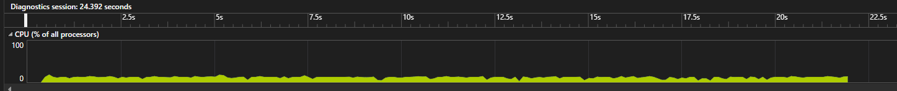
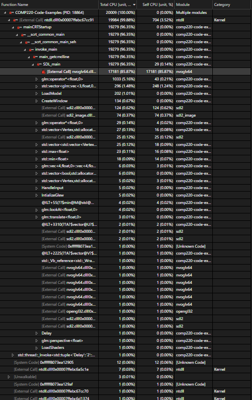
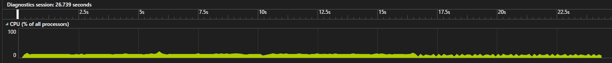
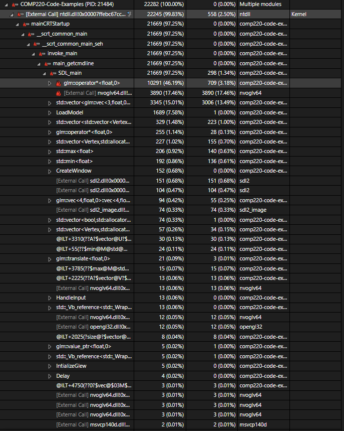
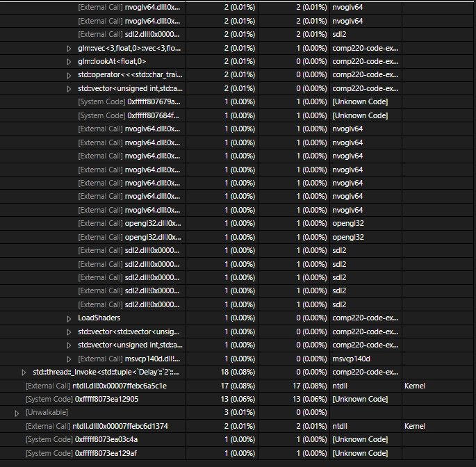
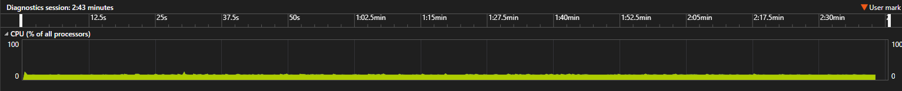
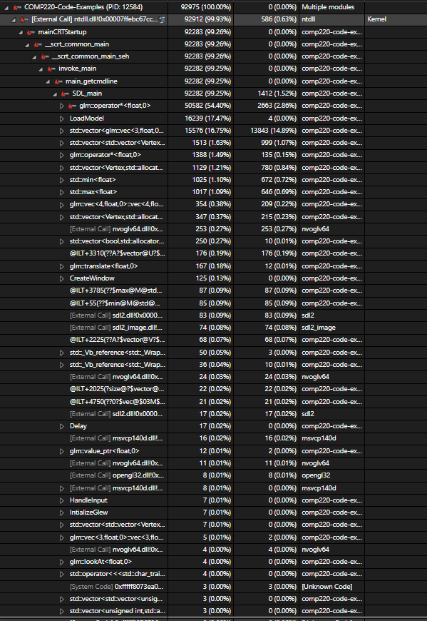
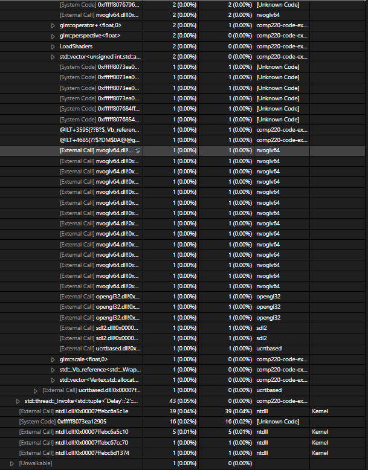

Since worksheet 3 I have added collision to the cubes and made them smaller, they also stop rendering a few seconds after colliding with the glass, this file is to take note of how these changes have effected the performance.

### 1 Model loaded:

Even with 1 model loading there is already a considerable increase over worksheet 3 in terms of cpu usage, with an average of 13 percent usage and a peak of 15 percent.

Just like worksheet 3 the hot path points to nvoglv64.dll using the majority of resources.

### 10 Models loaded:

With 10 models loaded there is still an average of 13 percent usage with a peak of 18 percent.

nvoglv64.dll is still the highest and just like worksheet 3 the usage is going up

### 100 Models loaded:

The usage is still at an average of 13 percent, however the peak has gone up to 21 percent.

Just like worksheet 3 "glm::operator*<float,0>" has taken over nvoglv64.dll as the item that is using the most resources, so far the collision and disappearing cubes does not seem to have had much of an impact on the performance of the artefact.

### 1000 Models loaded:

This is the first test that has revealed a noticeable drop in frame rate

Because of the lower frame rate during this run, the test took almost 3 minutes which is substantialy longer the the previous ones. The average is still 13 percent and the peak has also gone down to 20 percent instead of going up

While "glm::operator*<float,0>" is still the highest usage as expected, LoadModel is using considerably more usage then it was at 1000 models in worksheet 3.

